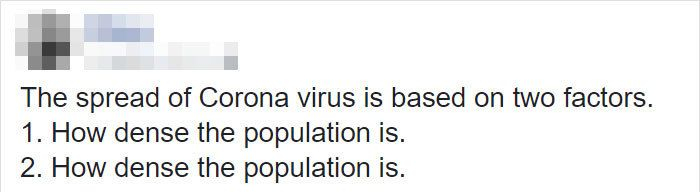

```{r setup, include=FALSE}
knitr::opts_chunk$set(echo = F, warning = F, message = F)
library(knitr)
library(ggplot2)
library(dplyr)
library(imputeTS)
library(tidyr)
library(ggrepel)
```

# Rządy w czasach zarazy

Epidemia nowego koronawirusa uruchomiła w nas rzadko spotykaną zgodność. Ogólnie się uważa, że trzeba myć ręce, zasłaniać twarze i izolować się od ludzi, ponieważ mamy powszechne przekonanie, że to, jak długo potrwa i jak dotkliwy będzie ten kryzys, zależy w największej mierze od nas samych. Można spotkać się z opiniami - jak ta na zdjęciu - że rozprzestrzenianie wirusa zależy tylko od dwóch czynników:




[źródło](https://www.boredpanda.com/coronavirus-covid-19-jokes/?utm_source=pl.pinterest&utm_medium=referral&utm_campaign=organic)

Ale przede wszystkim, kryzys daje okazję do ciskania gromów na rządzących. Jedni kochają nienawidzić swoich decydentów, inni kochają nienawidzić wszystkich pozostałych - a epidemia dostarcza wszystkim świeżych materiałów. 

W tej analizie chcę przyjrzeć się sytuacji państw UE, porównując, jak reagowały na zagrożenie i jak sobie z nim radziły. Mam nadzieję, że tekst okaże się przystępny nawet dla osób niezaznajomionych zbyt dobrze ze statystyką i pokaże Wam od innej strony to, co prawdopodobnie i tak śledzicie od dłuższego czasu.


# Problemy

Odpowiedzi na te pytania nie są wcale proste do znalezienia. Po drodze trzeba zmierzyć się z szeregiem problemów i podjąć sporo dość uznaniowych decyzji. **W ostateczności ocena zawsze zależy od wielu kryteriów i każdy może ją wystawić, kierując się własnymi priorytetami.**


## Dane

Epidemia nie jest eksperymentem ani zaplanowaną inwestycją, więc nie mógł powstać na jej potrzeby przemyślany i zunifikowany system zbierania danych. Istniejące już instytucje robią świetną robotę, ale trzeba się liczyć z brakami, możliwością nieścisłości, różnicami w definiowaniu wskaźników albo niepełnym zasięgiem geograficznym.


## Co oznacza sukces albo porażka?

Każdy możliwy sposób mierzenia suksesu w walce z epidemią ma wady i ograniczenia. 
Istnieją spisy potwierdzonych przypadków zarażenia wirusem, ale te liczby nie odzwierciedlają przecież rzeczywistej liczby przypadków - można by je zredukować do zera, po prostu nie przeprowadzając testów. Liczba śmierci może też zależeć od tego, w jakich przypadkach uznajemy, że to właśnie wirus był przyczyną zgonu. Zawsze gdy go stwierdzono, czy tylko gdy nie było poważniejszej choroby towarzyszącej?

Najbardziej intuicyjne wydawałoby się porównanie przeciętnej śmiertelności w latach poprzednich i oszacowanie "nadliczbowych śmierci". Wysoka liczba oznaczałaby bezsilność wobec wirusa, bliska zeru: że środki zaradcze okazały się skuteczne, a ujemna: że być może były po części zbędne. Problem w tym, że dane demograficzne na ten okres nie są powszechnie dostępne. To samo dotyczy wskaźników makroekonomicznych, jak PKB czy bezrobocie.  


## Kto za to odpowiada?

Inną kwestią jest, na ile działania państwa mają wpływ na sukses lub porażkę w tej walce. Niektóre tragedie są nie do uniknięcia, a ich łagodniejszy przebieg może wynikać z uprzywilejowanej z jakiegoś powodu pozycji państwa, a nie jego sprawności i zapobiegliwości. Nie wszystkie działania rządów jesteśmy też w stanie przedstawić liczbowo, część szczegółów zgubi się w koniecznej generalizacji, a nawet dobre pomysły mogą spalić na panewce, jeśli obywatele się do nich nie zastosują.


```{r preparations}

stringency_data <- read.table("stringency_data.csv")
policies <- read.table("policies_data.csv")

max_policies_used <- policies %>% group_by(country) %>% 
  select(country, restricts, care) %>% 
  summarise(max_restrict = max(restricts), max_care = max(care), 
            index = max_restrict/max_care)

countries_list <- max_policies_used$country

cases_completed <- read.table("cases_data_complete.csv")
cases_completed$date <- as.Date(cases_completed$date)
cases_completed <- cases_completed %>% group_by(location) %>%
                    mutate(cases = na_interpolation(cases))

first_cases <- cases_completed %>% select(location, date, cases) %>% group_by(location) %>%
  filter( ((lag(cases) == 0 | is.na(lag(cases))) & cases > 0)) %>% arrange(date)  

gdp <- read.csv("gdp.tsv") %>% filter(country %in% countries_list) %>%
  mutate(gdp = gdp*1000000) # w Euro

economic_measures <- policies %>%
  select(country, date, e1_incomesupport, e2_debtrelief, e3_fiscal, e4_intrsupport, 
         h4_healthcare_support, h5_vaccines) %>%
  group_by(country) %>% summarise(fiscal = sum(e3_fiscal, na.rm = T), 
                                  intr_support = sum(e4_intrsupport, na.rm = T),
                                  healthcare = sum(h4_healthcare_support, na.rm = T), 
                                  vaccines = sum(h5_vaccines, na.rm = T))

econ_measures_scaled <- economic_measures %>% left_join(gdp) %>%
  mutate(fiscal = fiscal/gdp*100, healthcare = healthcare/gdp*1000, 
         intr_support = intr_support/gdp*1000, vaccines = vaccines/gdp*1000)

elders <- read.csv("elders.tsv") %>% filter(country %in% countries_list)

```

# Rzut oka na sytuację

## Początek

Ponieważ chcę porównywać sytuację w różnych państwach, wszystkie liczby - zarażonych, zmarłych czy wykonanych testów - będą podane relatywnie, na 1 mln mieszkańców. To samo będzie dotyczyło sytuacji gospodarczej, gdzie sumy wydane na zapobiegnięcie kryzysowi będą podane w relacji do PKB.

W tabeli poniżej przedstawiono daty pojawienia się (a właściwie stwierdzenia obecności) wirusa w kolejnych państwach. Dane były zbierane przez organizację Our World In Data ([źródło](https://github.com/owid/covid-19-data)).

```{r first_case}
first_cases_table = data.frame(nr = 1:22, first_cases[,1:2])
kable(first_cases_table, caption = "Moment pojawienia się pierwszego przypadku",
      col.names = c("nr", "Państwo", "Data"))
```

Zgodnie z tymi danymi, wirus pojawił się w Europie w ostatnim tygodniu stycznia. W ciągu dziesięciu dni opanował sześć państw, głównie z połudiowo-zachodniej Europy. Druga fala zaczęła się pod koniec lutego, niemal codziennie ogarniając kolejny kraj. W Polsce wirus pojawił się bardzo późno, dopiero w marcu.

## Potwierdzone przypadki

Na wykresach przedstawiono liczbę potwierdzonych przypadków na 1 mln mieszkańców w każdym z państw w kolejnych dniach. Dla poprawienia czytelności, państwa podzielono według tego, jak wcześnie pojawił się w nich wirus. W pierwszej grupie znalazły się te, w których pierwszy przypadek stwierdzono na przełomie stycznia i lutego, w drugiej - pod koniec lutego, a trzecia obejmuje kraje, które epidemia dotknęła dopiero w marcu.

```{r cases_a}
first_countries <- first_cases %>% filter(date < "2020-02-10")
middle_countries <- first_cases %>% filter(date > "2020-02-10" & date < "2020-03-01")
last_countries <- first_cases %>% filter(date >= "2020-03-01")

cases_completed %>% filter(location %in% first_countries$location, date > "2020-01-20") %>%
  ggplot() + geom_line(aes(x = date, y = cases, col = location)) +
  labs(title = "Potwierdzone przypadki na 1 mln (grupa I)", x = "Czas", 
       y = "Potwierdzone przypadki", col = "Państwo")
```

```{r cases_b}
cases_completed %>% filter(location %in% middle_countries$location, date > "2020-02-20") %>%
  ggplot() + geom_line(aes(x = date, y = cases, col = location)) +
  labs(title = "Potwierdzone przypadki na 1 mln (grupa II)", x = "Czas", 
       y = "Potwierdzone przypadki", col = "Państwo")
```

```{r cases_c}
cases_completed %>% filter(location %in% last_countries$location, date > "2020-02-29") %>%
  ggplot() + geom_line(aes(x = date, y = cases, col = location)) +
  labs(title = "Potwierdzone przypadki na 1 mln (grupa III)", x = "Czas", 
       y = "Potwierdzone przypadki", col = "Państwo")
```

W najwcześniejszej grupie większość znajduje się między 1000 a 5000 przypadków na 1 mln (0,1 - 0,5%). Przez większość marca prowadziły Włochy, w ostatnim tygodniu marca wyprzedzone przez Hiszpanię. 

W drugiej grupie pięć państw ma mniej niż 0,2% przypadków. Mocno wybija się Szwajcaria - być może dlatego, że jest państwem małym (obiektywny nieduży przyrost zachorowań oznacza relatywnie wysoki wzrost) i praktycznie otoczonym państwami z pierwszej grupy.

Zdecydowana większość państw ostatniej grupy ma wciąż poniżej 0,1% zarażonych. Co ciekawe, w tej grupie znajduje się państwo o najwyższym w ogóle odsetku zarażonych - Luksemburg.  Trzeba jednak wziąć pod uwagę, że ma około 600,000 ludności (więc *rzeczywistych* przypadków jest mniej niż przypadków na 1 mln) i leży pomiędzy Niemcami a Francją.


## Testowanie

[Dane o liczbie wykonanych testów częściowo uzupełniałam z wykorzystaniem strony [worldometer](worldometers.info/coronavirus/?utm_campaign=homeAdvegas1?).]

Liczba znanych przypadków zakażenia zależy jednak w dużej mierze od tego, jak rzetelnie staramy się je znaleźć, czyli od liczby i sposobu przeprowadzania testów. Pojawiają się tutaj trzy zasadnicze problemy:

- Braki danych - o ile liczby zakażeń i śmierci są podawane dość rzetelnie przez wszystkie państwa, to liczby wykonywanych testów już nie są. Brakujące dane uzupełniono liniową interpolacją, przyjmując - jeśli to było konieczne - że pierwsze testy wykonano w dniu pojawienia się pierwszych przypadków i w liczbie odpowiadającej tym przypadkom. To niemal zawsze zaniża liczbę testów. Na górnym wykresie podano odsetek znanych wartości liczby testów. Im jest większy, tym bardziej wiarygodne dane.
- Polityka testowania - w niektórych państwach testy są wykonywane na szerokiej grupie, w innych tylko na ludziach, którzy mieli wysokie prawdopodobieństwo zetknięcia się z wirusem, albo nawet wyłącznie na tych, którzy wykazują objawy. Ze statystycznego punktu widzenia najlepsza jest ta pierwsza polityka testowania - im bardziej losowa grupa testowa, tym bardziej znana liczba zarażonych odzwierciedla stan faktyczny. Na dolnym wykresie przedstawiono przeciętny odsetek pozytywnych testów. Im jest niższy, tym bardziej "szerokie" testowanie.

Innym kolorem oznaczono Francję, gdzie odsetek pozytywnych testów okazał się większy od 1 (dla czytelności słupek na wykresie został obcięty). Wynika to z tego, że w pierwszych dniach rozwoju epidemii liczba testów jest na poziomie zera, mimo, że zarejestrowano już przypadki zarażenia. Trzeba to potraktować jako błąd w danych.

```{r testing}
cases_modified <- cases_completed %>% group_by(location) %>% 
                    mutate(tests_mod = if_else( 
                      ((lag(cases) == 0 & cases > 0 & is.na(tests)) | 
                         ( is.na(lag(cases)) & is.na(tests) & cases > 0)),
                      cases, if_else(cases == 0 & is.na(tests), 0, tests*1000))) %>%
                    mutate(tests_mod = na_interpolation(tests_mod))

# obliczenie śrdniego % pozytywnych testów 

positive_ratio <- cases_modified %>% select(location, cases, tests_mod) %>%
  group_by(location) %>% filter(tests_mod > 0) %>% mutate(positive_ratio = cases/tests_mod) %>%
  summarise(avg_positive_ratio = mean(positive_ratio))

complete_cases_ratio <- cases_completed %>% group_by(location) %>% filter(cases > 0) %>%
  summarise(complete_cases_ratio = sum(!is.na(tests))/n())

positive_ratio %>% left_join(complete_cases_ratio, by = "location") %>% 
  mutate(avg_positive_ratio = if_else(avg_positive_ratio > 0.2, 0.2, avg_positive_ratio)) %>%
  pivot_longer(c(avg_positive_ratio, complete_cases_ratio), 
               names_to = "type", values_to = "value") %>%
  mutate(type = if_else(type == "avg_positive_ratio", "Procent pozytywnych", "Procent kompletnych")) %>%
  ggplot(aes(x = location, y = value, 
             fill = factor(if_else(location == "France", "Highlighted", "Normal")))) +
  geom_col() + scale_fill_manual(values = c("dark red", "dark blue")) +
  facet_grid(rows = "type", scales = "free") +
  geom_text(aes(label=round(value, 2)), vjust=1, size=2.5, color = "white") +
  theme(axis.text.x = element_text(angle = 90, hjust = 1, vjust = 0)) +
  guides(fill=FALSE) +
  labs(title = "Stosunek pozytywnych testów do wszystkich wykonanych", x = "Państwo", 
       y = "Stosunek pozytywnych")

cases_tests_cor <- cases_modified %>% select(location, cases, tests_mod) %>%
  group_by(location) %>% summarise(max_cases = max(cases), max_tests =  max(tests_mod)) %>%
  summarise(cor = cor(max_cases, max_tests))
```

- Trzecia kwestia dotyczy interpretacji liczby potwierdzonych przypadków. Jeśli państwo X ma ich więcej niż państwo Y, czy to oznacza, że X znajduje się w gorszej epidemicznie sytuacji, czy raczej, że bardziej jest swojej prawdziwej sytuacji świadome? Jeśli dla każdego kraju wezmę liczbę przypadków i liczbę testów (w najwyższym punkcie) i policzę korelację, to wynosi ona `r round(cases_tests_cor$cor,4)`. Oznacza to, że **`r round(cases_tests_cor$cor, 2)*100`% zmienności maksymalnej liczby przypadków można wytłumaczyć zmiennością liczby testów, a nie różnicą w stopniu rozwoju epidemii**. Określenia takie jak "dużo" czy "mało" są zawsze uznaniowe, ale moim zdaniem to zdecydowanie za dużo, żeby uznać liczbę potwierdzonych przypadków za wskaźnik sytuacji państwa, zwłaszcza przy porównaniu z innymi.

Spróbuję teraz odfiltorwać ten efekt. Rozważmy model:

$$\ C = \alpha + \beta * T + \epsilon $$
gdzie:
C - liczba przypadków, T - liczba testów.

$\beta$ jest współczynnikiem, prawdopodobnie dużo mniejszym od 1, ponieważ z reguły T >> C. Oznacza on, jak duża część zmienności liczby przypadków wynika ze zmienności liczby testów. Innymi słowy: o ile większa byłaby liczba znanych przypadków, gdyby liczba testów była większa o jednostkę, **przy tym samym stanie faktycznym epidemii**. Od każdego C można odjąć człon $\beta * T$, uzyskując "czystą" liczbę przypadków.

Tak zmodyfikowana zmienna traci swoją podstawową interpretację - może być nawet ujemna. Ale przy porównaniach sytuacji nie faworyzuje państw, które przeprowadzają mniej testów.

Tak wygląda wyestymowany model:

```{r clean_cases}
# "czyszczenie" liczby przypadków z efektu testowania

tests_cases_model <- lm(cases ~ tests_mod, cases_modified)
summ <- summary(tests_cases_model, digits = 4)
kable(round(summ$coefficients,4))

cases_clean <- tests_cases_model$coefficients[1] + tests_cases_model$residuals

cases_basic_and_clean <- data.frame(cases = cases_modified$cases, cases_clean)
```

Współczynnik determinacji $R^2$ wynosi `r round(summ$r.squared,4)`. Oznacza on procent zmienności liczby przypadków, wyjaśniony przez liczbę testów. Różnica liczby przypadków między jednym a drugim państwem w `r round(summ$r.squared,2)*100` wynika z różnicy liczby przeprowadzonych testów, a tylko w `r 100-round(summ$r.squared,4)` z innych czynników, czyli faktycznej różnicy w skali epidemii.

(Analogicznie rozważyłam również wpływ struktury demograficznej społeczeństwa - odsetek osób po 60. roku życie - ale okazał się nieistotny.)


## Kolejka

Kolejną kwestią, którą trzeba uwzględnić, jest czas. Trudno szczycić się lekkim przebiegiem epidemii z pozycji kraju, które leży na geograficznym poboczu i miało dwa miesiące więcej na reakcję. 

Wyobraźmy sobie, że ustawiamy kraje w kolejności według pojawienia się pierwszego przypadku, oraz w drugiej kolejce, według "oczyszczonej" liczby przypadków. Jeśli w paru krajach epidemia zaczęła się w tym samym dniu, wyższe miejsce będzie miał ten, w którym tego dnia pojawiło się więcej przypadków. 

Gdyby w każdym kraju epidemia rozwijała się w takim samym tempie, każde państwo zajęłoby to samo miejsce w obu kolejkach. Tak jednak nie jest: znany jest choćby przykład Hiszpanii, która zaczęła później niż Włochy, a prześcignęła je pod względem liczby przypadków. Proponuję zatem obliczyć **wskaźnik rozwoju epidemii** (względem innych państw) jako różnicę między miejscem w kolejce czasu i kolejce przypadków. 

Jeśli w jakimś państwie epidemia rozwija się szybciej niż w państwie poprzednim (z wcześniejszą datą pierwszego przypadku), to "wyprzedza" je w kolejce i jego indeks wzrasta o 1. Państwa o ujemnym indeksie mają z kolei stosunkowo mało przypadków, biorąc pod uwagę moment, w którym zaczęły. Epidemia rozwija się tam wolniej, z czego wyciągamy wniosek, że jest *skuteczniej hamowana* (niekoniecznie prawdziwy, bo może to wynikać z niezależnych od człowieka czynników albo być dziełem przypadku, ale tak trzeba założyć w podstawowej analizie).

Wykres poniżej przedstawia wartości indeksu. 

```{r rangs}
# rangowanie państw pod względem długości trwania epidemii i liczby przypadków

cases_queue <- data.frame(location = cases_modified$location, 
                          date = cases_modified$date, cases_clean) %>%
  group_by(location) %>% summarise(max_cases = max(cases_clean)) %>%
  arrange(desc(max_cases)) %>% mutate(cases_nr = 1:n())

time_queue <- cases_modified %>% select(location, date, cases) %>%
  filter(cases > 0) %>% group_by(location) %>% 
  summarise(days = n(), first_day_cases = min(cases)) %>%
  arrange(desc(days), desc(first_day_cases)) %>% mutate(time_nr = 1:n())

epidemic_develop_index <- cases_queue %>% left_join(time_queue, by = "location") %>%
  mutate(index = time_nr - cases_nr)

epidemic_develop_index %>% arrange(time_nr) %>% 
  mutate(lower = if_else(time_nr > cases_nr, cases_nr, time_nr), 
         upper = if_else(time_nr > cases_nr, time_nr, cases_nr), 
         outcome = if_else(index > 0, "pos", "neg"),
         location_nr = 1:n()) %>%
  ggplot(aes(x = location, y = index)) + 
  geom_bar(aes(fill = outcome), stat = "identity") +
  scale_fill_manual(values = c("dark blue", "dark red")) +
    guides(fill=FALSE) + theme(legend.position = "none") +
  geom_text(aes(label=index, color = outcome), vjust=-0.2, size=3.5) +
  scale_color_manual(values = c("white", "black")) +
  theme(axis.text.x = element_text(angle = 90, hjust = 1, vjust = 0)) +
  labs(title = "Wskaźnik względnego rozwoju epidemii", x = "Państwo", 
       y = "Wskaźnik")
```

Zdecydowanie najlepiej wypadają Niemcy, które zaczęły epidemię jako jedne z pierwszych, a pod względem przypadków znalazły się blisko końca. Bardzo dobry wynik ma też Finlandia. Polska również znalazła się "po dobrej stronie mocy", z wartością indeksu -4.


## Śmiertelność

Inną kwestią jest śmiertelność choroby powodowanej przez wirusa, czyli stosunek liczby śmierci do liczby zarażonych. Jeżeli założymy, że:

- w analizowanych państwach mamy do czynienia z tym samym wirusem, a nie, np. w niektórych z groźniejszą mutacją;
- śmierci pacjentów z pozytywnym wynikiem testu są wszędzie traktowane jako śmierci związane z wirusem, niezależnie od innych chorób;
- na śmiertelność nie wpływają istotnie inne czynniki, np. środowiskowe czy demograficzne;

to różnice w poziomie śmiertelności mogą odzwierciedlać wydajność służby zdrowia w poszczególnych państwach. Im bardziej zaawansowana i dostępna opieka medyczna, tym mniej przypadków choroby skończy się tragicznie.

Rzetelne zweryfikowanie tych założeń wymaga eksperckiej wiedzy, ale jedną rzeczą, którą na pewno warto sprawdzić, jest struktura demograficzna. Wiadomo, że najciężej chorobę przechodzą osoby starsze, dlatego większa śmiertelność może wynikać wprost z większego odsetka takich osób w społeczeństwie. Analogicznie jak dla liczby przypadków i testowania, można przygotować model:

```{r mortality_and_elders}

cases_modified_elders <- cases_modified %>% left_join(elders, by = c("location" = "country"))

mortality <- cases_modified_elders %>% select(location, cases, deaths, elders) %>%
  group_by(location) %>% filter(cases > 0 & !is.na(deaths)) %>% mutate(death_rate = deaths/cases)

mort_elders_model <- lm(death_rate ~ elders, mortality)
summ <- summary(mort_elders_model, digits = 4)
kable(round(summ$coefficients,4))

mortality$death_rate_mod <- mort_elders_model$coefficients[1] + mort_elders_model$residuals

final_mortality <- mortality %>% group_by(location) %>% arrange(desc(cases)) %>% slice(1) %>%
  summarise(mortality = death_rate_mod)

total_cases <- cases_modified %>% 
  group_by(location) %>% arrange(desc(cases)) %>% slice(1) %>%
  summarise(nr_cases = cases)

```

Odsetek starszych osób w społeczeństwach nie wyjaśnia dobrze różnic w śmiertelności ($R^2$ = `r  round(summ$r.squared,4)`, więc jest bardzo niskie), co oznacza, że nie można zrzucić całej winy za wyższą śmiertelność na różnice demograficzne. Być może wynika to z faktu, że badane kraje nie są zbyt mocno zróżnicowane pod tym względem. Niemniej, demografia jest istotna, więc nie zaszkodzi "oczyścić" wskaźnika śmiertelności, podobnie, jak to było robione wcześniej.

Drugą rzeczą, którą trzeba uwzględnić, jest stosunek śmiertelności do liczby przypadków. Służby zdrowia - liczby łóżek, personelu i sprzętu - nie da się łatwo skalować. Nawet dobrze zorganizowany system może nie wytrzymać nagłego, dużego napływu pacjentów. I *vice versa*, nawet niezbyt sprawny poradzi sobie z nielicznymi przypadkami.

Wykres poniżej pokazuje tę zależność. Czerwonymi liniami oznaczono mediany obu zmiennych, dodatkowo żółtymi kwantyle 25% i 75%. 

```{r mortality}

q_nr_cases <- quantile(total_cases$nr_cases, probs=c(0.25, 0.5, 0.75))
q_mortality <- quantile(final_mortality$mortality, probs=c(0.25, 0.5, 0.75))

total_cases %>% left_join(final_mortality, by = "location") %>% 
  ggplot(aes(x = nr_cases, y = mortality)) +
  geom_vline(xintercept = q_nr_cases[2], color = "red") +
  geom_vline(xintercept = c(q_nr_cases[1], q_nr_cases[3]), color = "yellow") +
  geom_hline(yintercept = q_mortality[2], color = "red") +
  geom_hline(yintercept = c(q_mortality[1], q_mortality[3]), color = "yellow") +
  geom_point() + geom_text_repel(aes(label=location), vjust=-0.7, size=3) +
  labs(title = "Stosunek śmiertelności do liczby przypadków (na mln mieszkańców)",
        x = 'Liczba przypadków', y = '"Oczyszczona" śmiertelność')

healthcare_index <- total_cases %>% left_join(final_mortality) %>% 
  mutate(mortality = mortality - min(mortality)) %>%
  mutate(healthcare_index = mortality/nr_cases*10000)
```

Jeśli podzielimy przestrzeń wykresu według czerwonych linii na cztery części, to w prawym dolnym rogu znajdą się państwa, które mają niską śmiertelność mimo wysokiej liczby przypadków - Szwajcaria, Luksemburg, Portugalia, Austria i Niemcy. Ich służba zdrowia jest na tyle sprawna, że jest w stanie ratować pacjentów nawet przy dużej ich liczbie.

W lewym dolnym rogu mamy państwa, które uzyskały niską śmiertelność, ale też nie musiały się zmierzyć z aż tak dużym wyzwaniem. Z kolei w prawym górnym takie, w których śmiertelność jest wysoka, ale poniekąd usprawiedliwona skalą epidemii.

I wreszcie w lewym górnym rogu można znaleźć państwa o wysokiej śmiertelności mimo małej skali zachorowań - Węgry, Bułgaria, Grecja, Polska, Rumunia, Słowenia i Cypr.

Ten stosunek śmiertelności do liczby przypadków możemy potraktować jako **wskaźnik jakości służby zdrowia**, przy założeniu, że trudność leczenia (zapobiegania śmierci) pacjentów jest wprost proporcjonalna do ich liczby. Wyobraźmy sobie, że w jednym szpitalu mamy 5000 pacjentów i śmiertelność 1%, a w drugim 500 pacjentów i taką samą śmiertelność 1%. Pod względem wyników szpitale mogą się wydawać dokładnie tak samo dobre. Ale intuicyjnie rozumiemy, że pierwszy szpital musi być dużo lepszy (więcej miejsca, sprzętu, personelu itd.), skoro mógł zaopiekować się dziesięciokrotnie większą liczbą pacjentów, zachowując tę samą jakość.

```{r health_gdp}
healthcare_index_gdp <- healthcare_index %>% 
  left_join(gdp, by = c("location" = "country")) %>%
  summarise(cor = cor(healthcare_index, gdp))
```

Ostatnim czynnikiem, który tu rozważałam, było PKB. Moglibyśmy się spodziewać, że bogatsze kraje będą siłą rzeczy miały lepszą służbę zdrowia, i że ten efekt należałoby uwzględnić. Okazuje się jednak, że korelacja między wskaźnikiem jakości służby zdrowia a PKB wynosi `r round(healthcare_index_gdp, 4)' i ten czynnik jest nieistotny. 

Dlaczego tak się dzieje? Oczywiście może istnieć wiele czynników uniezależniających jakość służby zdrowia od PKB (np. różnice w tym, jak duża część PKB idzie na służbę zdrowia, albo "nieprodukcyjny" charakter tej dziedziny), ale w tym przypadku prawdopodobnie wynika to z silnego związku między zamożnością państw a rozwojem epidemii. Z pierwszych 10 państw, w których pojawił się wirus, aż 7 jest w pierwszej dziesiątce pod względem PKB. Dzieląc śmiertelność przez rozmiar epidemii (liczbę przypadków), przypadkiem przy okazji mogłam zniwelować też efekt zamożności.

## Gospodarka

Jedną z głównych osi napięcia jest ta między restrykcjami związanymi z epidemią a potrzebami gospodarki. Zamykanie lokali usługowych, wstrzymanie ruchu turystycznego, zwalnianie pracowników, którzy nie mogą realizować swojej pracy w domach - to wszystko w oczywisty sposób prowadzi do spowolnienia.

Ponownie natrafiamy tu na szereg problemów. Makroekonomiczne wskaźniki - jak bezrobocie czy PKB - nie są obliczane na bieżąco. Oczywistym rozwiązaniem są giełdy, publikujące notowania codziennie. Indeksy, takie jak WIG, odzwierciedlają ogólny stan giełdy i są używane jako wskaźniki stanu gospodarki, ale wciąż trzeba pamiętać, że gospodarka nie sprowadza się do spółek akcyjnych. A także, że indeksy są konstruowane w różny sposób i niekoniecznie w pełni porównywalne.

Drugi problem jest taki, że trudno znaleźć obiektywny punkt odniesienia. Na wykresie porównano procentowe przyrosty (wszystkie są ujemne) głównych indeksów giełdowych między końcem zeszłego roku (30.12.19) a końcem badanego okresu (30.04.20) oraz najniższym notowaniem osiągniętym w całym tym okresie (dla większości było to w marcu). Widać, że spadek mógł sięgać niemal 50%. Niektóre państwa, jak Dania, zdążyły do końca kwietnia skoczyć do góry. Inne, jak Cypr, pozostały na podobnym poziomie.

```{r stock}
stock <- read.csv("stock.txt") %>% mutate(change = (last_apr - last_dec)/last_dec, 
                                          max_change = (min - last_dec)/last_dec)

stock %>% mutate(label = paste(country, index)) %>%
  pivot_longer(c(change, max_change), 
               names_to = "type", values_to = "value") %>%
  ggplot(aes(x = label, y = value)) + geom_col(fill = "dark red") +
  facet_grid(rows = "type") +
  geom_text(aes(label=round(value, 2)), vjust=-0.3, size=2.5, color = "white") +
  theme(axis.text.x = element_text(angle = 90, hjust = 1, vjust = 0)) +
  labs(title = "Procentowa zmiana wartości indeksów (30.12.19 - 30.04.20)",
       x = "Państwo", y = "Procentowa zmiana")
```


# Front walki z wirusem

Przechodzimy wreszcie do analizy działań rządów. Zbiór danych został przygotowany w ramach projektu *Oxford COVID-19 Government Response Tracker* ([źródło](https://github.com/OxCGRT/covid-policy-tracker)). Zawiera kilkanaście zmiennych określających stopień wykorzystania różnych środków walki z epidemią poszczególnych państw, notowanych codziennie, oraz obliczony na ich podstawie Wskaźnik Surowości (Stringency Index).

## Zmienne

Pierwsza grupa zmiennych odnosi się do **zakazów i ograniczeń nałożonych na obywateli**. Są to:

- [C1] zamykanie szkół i uniwersytetów: 0 - brak; 1 - rekomendowane; 2 - nakazane zamknięcie określonego rodzaju (np. tylko szkół wyższych lub tylko publicznych); 3 - nakazane zamknięcie wszystkich rodzajów szkół;
- [C2] zamykanie miejsc pracy: 0 - brak; 1 - rekomendowane; 2 - nakazane dla niektórych zawodów; 3 - nakazane dla wszystkich, z wyjątkiem niezbędnych zawodów; 
- [C3] odwołanie wydarzeń publicznych: 0 - brak; 1 - rekomendowane; 2 - nakazane; 
- [C4] ograniczenia spotkań: 0 - brak; 1 - restrykcje powyżej 1000 osób; 2 - restrykcje między 100 a 1000 osób; restrykcje między 10 - 100 osób; restrykcje poniżej 10 osób; 
- [C5] zamykanie publicznego transportu: 0 - brak; 1 - rekomendowane (lub zmniejszanie częstotliwości kursów); 2 - zamknięcie transportu (lub zakazanie większości obywateli korzystania z niego); 
- [C6] nakaz pozostania w domu: 0 - brak; 1 - zalecane; 2 - możliwość wyjścia tylko w koniecznych sytuacjach (zakupy, spacer z psem itd.); 3 - silne ograniczenia (np. możliwość wyjścia raz na kilka dni);
- [C7] ograniczenia przemieszczania się (wewnątrz kraju): 0 - brak; 1 - rekomendowane; 2 - ograniczone; 
- [C7] kontrole podróży międzynarodowych (z regionów wysokiego ryzyka): 0 - brak; 1 - testy; 2 - kwarantanna; 3 - zakaz podróży do i z obszarów wysokiego ryzyka; 4 - całkowite zamknięcie granic.

Zmienne C1 do C7 mają dodatkowo flagę oznaczającą zakres oddziaływania: 0 - regionalne lub stargetowane; 1 - obowiązujące ogólnie i w całym kraju.

Druga grupa zmiennych dotyczy **postępowania państwa**:

- [H1] kampania informacyjna o COVID-19: 0 - brak; 1 - przedstawiciele władz ostrzegające o zagrożeniu i zachęcające do ostrożności; 2 - regularna kampania informacyjna;
- [H2] polityka testowania: 0 - brak testów; 1 - testowanie wyłącznie ludzi z symptomami **i jednocześnie** spełniających dodatkowe kryteria (np. kontakt ze znanym przypadkiem, kluczowa grupa zawodowa, powracający zza granicy); 2 - testowanie każdego z symptomami; 3 - otwarte testy, dostępne dla każdego;
- [H3] - śledzenie przypadków (z kim miały kontakt osoby zarażone): 0 - brak; 1 - limitowane, dla niektórych przypadków; 2 - zawsze;
- [E1] państwo wypłaca pensje obywatelom, którzy w wyniku restrykcji stracili pracę: 0 - brak; 1 - mniej niż 50% utraconego lub przeciętnego wynagrodzenia; 2 - więcej niż 50% utraconego lub przeciętnego wynagrodzenia;
- [E2] zwolnienie gospodarstw domowych z długów lub innych zobowiązań (np. zamrożenie kredytów, zakaz odcinania niepłacącym wody itp.): 0 - brak; 1 - wąski zakres, jeden typ kontraktu; 2 - stosowane szeroko, dla wielu typów kontraktów.  

Zmienna H1 ma również flagę oznaczającą zakres oddziaływania regionalnego, natomiast E1 ma flagę zakresu formalnego: 0 - tylko dla pracowników etatowych; 1 - dla wszystkich pracowników.

Wreszcie trzecia grupa dotyczy **działań w formie finansowej**:


- [E3] ekonomiczna/fiskalna stymulacja gospodarki, zarówno jako zastrzyk pieniędzy jak i ulgi podatkowe: wyrażona w USD;
- [E4] pomoc finansowa udzielona innym krajom na walkę z epidemią COVID-19.
- [H4] krótkoterminowa, dodatkowa inwestycja w służbę zdrowia: wyrażona w USD;
- [H5] inwestycja w badania nad szczepionką: wyrażona w USD;


## Wskaźnik surowości

Wskaźnik jest obliczany na podstawie pierwszej grupy oraz zmiennej H1. Dla każdej zmiennej sumowana jest jej wartość oraz wartość flagi (jeśli występuje) i dzielona przez maksymalną wartość, jaką da się dla niej uzyskać. **Wskaźnik jest średnią ze wszystkich tak obliczonych wartości.** Można go interpretować jako intensywność działań o charakterze legislacyjnym, podejmowanych przez rządy.

Wykresy pokazują, jak wzrastał poziom wskaźnika surowości w różnych krajach. Podzielono je na takie same grupy jak w poprzednich sekcjach. 

```{r stringency_a}

stringency_data$date = as.Date(stringency_data$date)

stringency_data %>% 
  filter(country %in% first_countries$location) %>%
  ggplot() + geom_line(aes(x = date, y = stringency, col = country)) +
  labs(title = "Stringency Index (Grupa I)",
       x = "Czas", y = "Stringency Index", col = "Państwo")
```

```{r stringency_b}
stringency_data %>% 
  filter(country %in% middle_countries$location) %>%
  ggplot() + geom_line(aes(x = date, y = stringency, col = country)) +
  labs(title = "Stringency Index (Grupa II)",
       x = "Czas", y = "Stringency Index", col = "Państwo")
```

```{r stringency_c}
stringency_data %>% 
  filter(country %in% last_countries$location) %>%
  ggplot() + geom_line(aes(x = date, y = stringency, col = country)) +
  labs(title = "Stringency Index (Grupa III)",
       x = "Czas", y = "Stringency Index", col = "Państwo")
```


W pierwszej grupie działania były intensyfikowane stopniowo: zaczynając już od końca stycznia, największe wzrosty zaliczyły pod koniec marca i ustabilizowały się w kwietniu. Przez większą część badanego okresu w walce z epidemią przodowały Włochy, ostatecznie bardzo wysoką wartość wskaźnika osiągnęły też Hiszpania i Francja. Belgia, Finlandia i Niemcy prowadzą nieco łagodniejszą politykę kryzysową.

W drugiej i trzeciej grupie restrykcje są wprowadzane gwałtownie i niemal w tym samym czasie (połowa marca). Ostatecznie wszędzie wskaźnik osiąga podobne poziomy: 60 - 90%


## Styl kryzysowy


Oprócz intensywności działań, można również rozważać różnice w stylu radzenia sobie z kryzysem. Zamiast jednego wskaźnika, obliczę dwa: dla grupy restrykcji i zakazów (C1 - C8) oraz dla grupy działań podejmowanych przez państwo (E1, E2, H1 - H3). Pozycja w przestrzeni wyznaczonej przez te dwie osie pokazuje styl radzenia sobie z kryzysem epidemii.

```{r strategy}

max_policies_used %>% ggplot(aes(x = max_care, y = max_restrict)) +
  geom_abline(slope = 1, intercept = 0, color = "green") +
  geom_abline(slope = 2, intercept = 0, color = "red") +
  geom_abline(slope = 1.5, intercept = 0, color = "yellow") +
  geom_point() + geom_text_repel(aes(label=country)) +
  expand_limits(x = c(0.2, 1.0), y = c(0.4, 1.0)) +
  labs(title = "Strategie walki z epidemią", x = "Strategia wspomagania", 
       y = "Strategia restrykcji")
```

Można zauważyć, że państwa generalnie w większym stopniu sięgają po restrykcje (dlatego osie nie zaczynają się w zerze). W lewym dolnym rogu mamy państwa o względnie niskiej intensywności każdego rodzaju działań, a w prawym górnym te, które stosują chętnie jeden i drugi. Zielona linia wyznacza stosunek 1:1. Tylko dwa państwa (Austria i Luksemburg) chętniej sięgają po strategię wspomagania niż restrykcji (Rumunia i Irlandia są na granicy). Żółta linia ma nachylenie 1,5. Większość państw znajduje się między nią a zieloną, co oznacza, że stosują obie strategie w podobnym stopniu, ale jednak z preferencją dla restrykcji. Wreszcie czerwona linia wyznacza stosunek 2:1. Polska, Grecja, Dania i Słowenia to kraje, gdzie rząd ponad dwukrotnie intensywniej stosuje restrykcje niż strategię wspomagania.

Jakie to ma znaczenie? Można argumentować, że w czasach zarazy odpowiedzialni obywatele powinni ze zrozumieniem przyjąć nałożone na nich ograniczenia, kierując się troską o zdrowie i życie innych ludzi. Podążając za tą przesłanką, można pochwalać rządzących, którzy nie wahają się sięgać po tak poważne ograniczenia swobody swoich suwerenów, choć wiedzą, jaki to będzie miało skutek dla gospodarki i jak wielu ludziom utrudni to życie.

Z drugiej strony, lekkość nakładania na obywateli restrykcji i zamykania całych dziedzin ich życia może świadczyć o lekceważeniu przez władzę sytuacji "zwykłych ludzi" czy patrzeniu na nich z góry. Zwłaszcza, jeśli nie idzie w parze z równie intensywnymi działaniami ze strony państwa.


## Działania ekonomiczne

Osobno będziemy rozpatrywać zastrzyki finansowe. 

Pierwsza zmienna dotyczy wydatków poniesionych na rzecz ratowania gospodarki przed kryzysem, nieunikalnie związanym z epidemią. *Wydatki* mogą tu być zarówno zasiłkami jak i ulgami podatkowymi (dlatego ich wartości potrafią być tak wysokie). Wyrażone są w procentach PKB (z ostatniego kwartału 2019), dla czytelności ucięte na poziomie 200 (etykiety przy słupkach przedstawiają realne wartości).

Ta forma reakcji na epidemię ma bardzo dużą wariancję. Od państw, które nie korzystają z niej wcale, do wydających wielokrotność swojego PKB. 

```{r fiscal}
econ_measures_scaled %>% mutate(fiscal_adj = if_else(fiscal > 200, 200, fiscal)) %>%
  ggplot(aes(x = country, y = fiscal_adj)) + geom_col(fill = "dark blue") +
  geom_text(aes(label=round(fiscal, 2)), vjust=-0.3, size=2.5) +
  theme(axis.text.x = element_text(angle = 90, hjust = 1, vjust = 0)) +
  labs(title = "Wydatki fiskalne i ulgi podatkowe",
       x = "Państwo", y = "Procent PKB")
```


Druga forma to wydaki bezpośrednio zasilające służbę zdrowia, *poza* normalnymi wydatkami na ten resort. Tym razem zostały wyrażone w promilach PKB. 

Widać, że wydatkami również rządzą rozmaite strategie. Są państwa, które nie skorzystały z żadnej z tych form (jak Finlandia), a są takie, które intensywnie wykorzystały obie (np. Cypr). Niektóre, (jak Polska i Włochy), wydały stosunkowo dużo na gospodarkę i niewiele na służbę zdrowia - inne skupiły się przede wszystkim na zdrowiu. Porównując te liczby należy mieć w pamięci różnice skal. Na przykład Niemcy poświęcili mniej więcej tyle samo na rzecz gospodarki i służby zdrowia.

```{r healthcare}
econ_measures_scaled %>% mutate(healthcare_adj = if_else(healthcare > 100, 100, healthcare)) %>%
  ggplot(aes(x = country, y = healthcare_adj)) + geom_col(fill = "dark blue") +
  geom_text(aes(label=round(healthcare, 2)), vjust=-0.3, size=3) +
  theme(axis.text.x = element_text(angle = 90, hjust = 1, vjust = 0)) +
  labs(title = "Dodatkowe nakłady na służbę zdrowia",
       x = "Państwo", y = "Promil PKB")
```


Inwestycje w szczepionkę mają nieco inny charakter, ponieważ nie są działaniem bezpośrednio na rzecz własnego kraju, ale -  wszystkich cierpiących z powodu epidemii. Sześć państw, które zaangażowały się w te badania, możemy umieścić w swoistej Hall of Fame zasłużonych dla ludzkości. Są to: Hiszpania, Niemcy, Finlandia, Francja, Słowenia oraz Szwajcaria.

```{r vaccines}
econ_measures_scaled %>% filter(vaccines > 0) %>%
  ggplot(aes(x = country, y = vaccines)) + geom_col(fill = "dark blue") +
  geom_text(aes(label=round(vaccines, 2)), vjust=-0.3, size=3.5) +
  theme(axis.text.x = element_text(angle = 90, hjust = 1, vjust = 0)) +
  labs(title = "Inwestycje w tworzenie szczepionki",
       x = "Państwo", y = "Promil PKB")

```

Podobnie jest w przypadku udzielania międzynarodowej pomocy:

```{r aid}
econ_measures_scaled %>% filter(intr_support > 0) %>%
  ggplot(aes(x = country, y = intr_support)) + geom_col(fill = "dark blue") +
  geom_text(aes(label=round(intr_support, 4)), vjust=-0.3, size=3.5) +
  theme(axis.text.x = element_text(angle = 90, hjust = 1, vjust = 0)) +
  labs(title = "Pomoc finansowa udzielana innym krajom",
       x = "Państwo", y = "Promil PKB")
```


# Tworzenie wskaźników

W poprzednich sekcjach starałam się przedstawić jak najszerzej sytuację i uzasadnić dokonane wybory. Teraz spróbuję podsumować zebrane informacje w następujących wskaźnikach:

- różnica między pozycją państwa pod względem czasu trwania epidemii i pod względem liczby przypadków - jako **wskaźnik rozwoju epidemii**. Jeśli jest dodatnia, państwo ma względnie silnie rozwiniętą epidemię; jeśli ujemna, udało się ją zahamować relatywnie dobrze;
- stosunek śmiertelności (z usuniętym czynnikiem demograficznym) do liczby przypadków na 1 mln mieszkanców - wskaźnik **jakości służby zdrowia**. Im gorzej służba zdrowia była przygotowana, tym jest wyższy;
- stosunek stopnia ograniczeń nałożonych na obywateli do stopnia działań podjętych przez państwo - jako **wskaźnik stylu rządzenia w kryzysie**. Im wyższe wartości, tym bardziej "autorytarny" styl;
- najgłębszy procentowy spadek głównego indeksu giełdowego w stosunku do końca roku 2019 - jako **wskaźnik kryzysu gospodarczego**. Im większa liczba (mniejszy spadek) tym lepiej;

Idea jest taka, że wskaźniki mają mierzyć **sytuacje państw/społeczeństw**, a nie skalę podejmowanych działań. Dlatego nie ma w nich zawartej informacji np. o podanych wyżej nakładach na służbę zdrowia czy ratowanie gospodarki. Wskaźnik stylu rządzenia jest liczony z tych danych, ale zawiera informację o proporcji jednego typu działań do innego, a nie o ich obiektywnym natężeniu. Nie mierzy on, **jak dużo państwo robi**, ale czy dla obywatela państwo przejawia się w kryzysie jako przede wszystkim **źródło pomocy** czy **źródło restrykcji**. 


```{r index_table}
index_table <- epidemic_develop_index %>% select(location, epid_index = index) %>%
  left_join(healthcare_index) %>% 
  left_join(max_policies_used, by = c("location" = "country")) %>% 
  select(location, epid_index, healthcare_index, style_index = index) %>%
  left_join(stock, by = c("location" = "country")) %>% 
  select(location, epid_index, healthcare_index, style_index, econ_index = max_change)

kable(index_table, digits = 4, caption = "Wartości wskaźników", 
      col.names = c("Państwo", "Wskaźnik rozwoju epidemii", "Wskaźnik jakości służby zdrowia","Wskaźnik stylu zarządzania", "Wskaźnik kryzysu na giełdzie"))
```

Wskaźniki można by zagregować średnią ważoną, żeby ustawić państwa w kolejności od najlepiej radzącego sobie z epidemią do najgorszych. Wybranie wag nie jest jednak łatwe, bo każdy wskaźnik ma inny charakter i skalę. Wymagałoby to też decyzji, jak duże znaczenie dla ostatecznej oceny mają poszczególne wskaźniki. Można by na przykład uznać, że wskaźnik stylu zarządzania w kryzysie jest dużo mniej istotny niż pozostałe, albo że gospodarka jest ważniejsza niż liczba przypadków, skoro zdecydowana większość z nich nie jest poważnym zagrożeniem dla zdrowia.

Zupełnie innym podejściem jest znalezienie **zbioru rozwiązań optymalnych w sensie Pareto**. Każde państwo traktujemy jak jedno rozwiązanie problemu epidemii, który chcemy optymalizować pod kątem wymienionych wyżej czterech kryteriów. Rozwiązanie jest **zdominowane**, jeśli można znaleźć inne rozwiązanie, które jest lepsze pod względem jednego z kryteriów i lepsze bądź równe pod względem wszystkich pozostałych. 

Zbiór **niezdominowanych** rozwiązań jest optymalny w sensie Pareto - nie ma jednego państwa, które radzi sobie absolutnie najlepiej, ale każde z nich najlepiej realizuje swoją specyficzną strategię. Państwa, które okazały się niezdominowane to: **Irlandia, Luksemburg, Włochy, Francja, Szwajcaria, Austria, Rumunia, Estonia, Bułgaria, Finlandia, Niemcy i Czechy**.

```{r pareto}
search_pareto <- function(base, nr) {
  epid_best <- base %>% arrange(epid_index) %>% slice(nr)

epid_pareto <- base %>% filter((epid_index <= epid_best$epid_index) | 
  (healthcare_index <= epid_best$healthcare_index) |
  (style_index <= epid_best$style_index) | (econ_index >= epid_best$econ_index))

health_best <- epid_pareto %>% arrange(healthcare_index) %>% slice(nr)

health_pareto <- epid_pareto %>% filter((epid_index <= health_best$epid_index) |
   (style_index <= health_best$style_index) | (healthcare_index <= health_best$healthcare_index) |
     (econ_index >= health_best$econ_index))

style_best <- health_pareto %>% arrange(style_index) %>% slice(nr)

style_pareto <- health_pareto %>% filter((epid_index <= style_best$epid_index) |
   (healthcare_index <= style_best$healthcare_index) | (style_index <= style_best$style_index) |
     (econ_index >= style_best$econ_index))

econ_best <- style_pareto %>% arrange(desc(econ_index)) %>% slice(nr)

econ_pareto <- style_pareto %>% filter((epid_index <= econ_best$epid_index) |
   (healthcare_index <= econ_best$healthcare_index) | (style_index <= econ_best$style_index)
   | (econ_index >= econ_best$econ_index))

return(econ_pareto)
}

base <- index_table
nr <- 1
repeat {
  base <- search_pareto(base, nr)
  nr <- nr+1
  if(nr == dim(base)[1]){
    break
  }
}

```


Jeśli założymy, że **wszystkie kryteria mają takie samo znaczenie**, to problem różnych jednostek i rzędów wielkości wskaźników można ominąć, konstruując coś w rodzaju *klasyfikacji medalowej*. Najpierw rzutuję wszystkie wskaźniki na tę samą skalę. Najlepszy (pod danym względem) kraj będzie miał wartość 0, a najgorszy 1. Teraz mogę policzyć średnią, a na końcu uszeregować państwa od najlepszego wyniku (najniższa średnia) do najgorszego (najwyższa).

```{r ranks}
ranks_table <- index_table %>%
  mutate(min_epid = min(epid_index), range_epid = max(epid_index)-min(epid_index),
         min_health = min(healthcare_index), range_health = max(healthcare_index)-min(healthcare_index),
         min_style = min(style_index), range_style = max(style_index)-min(style_index),
         min_econ = min(econ_index), range_econ = max(econ_index)-min(econ_index)) %>%
  mutate(epid_ranks = (epid_index - min_epid)/range_epid) %>%
  mutate(health_ranks = (healthcare_index - min_health)/range_health) %>%
  mutate(style_ranks = (style_index - min_style)/range_style) %>%
  mutate(econ_ranks = 1-(econ_index - min_econ)/range_econ) %>%
  mutate(index = (epid_ranks + health_ranks + style_ranks + econ_ranks)/4) %>%
  mutate(position = rank(index, ties.method = "min"))

ranks_table %>% select(location,epid_ranks,health_ranks,style_ranks,econ_ranks,index,position) %>% arrange(position) %>%
  kable(caption = "Klasyfikacja", col.names = c("Państwo", "Hamowanie epidemii", "Jakość służby zdrowia", "Styl zarządzania", "Giełda", "Średnia", "Pozycja"), digits = 4)
```

Na podium znalazły się Finlandia, Szwajcaria i Niemcy. Polska sprawdziła się dobrze w hamowaniu epidemii, ale wypadła słabo we wszystkich pozostałych kategoriach, więc zajęła miejsce w ogonie tabeli.

# Podsumowanie

To już wszystko. Rozgryzanie tych danych było ciekawym doświadczeniem i przyznam, że gdybym miała przed tym zgadywać wyniki klasyfikacji, wypadłabym bardzo słabo. 

Mam przede wszystkim nadzieję, że ta analiza pokaże wam, że przejście od prostych liczb do wniosków o ich przyczynach nie jest ani łatwe, ani oczywiste. Po drodze trzba postawić szereg założeń, dotyczących zarówno rzeczywistego świata jak i własnych priorytetów i przekonania o tym, co jest korzystne, a co nie. Trzeba pamiętać, że klasyfikacja mogłaby ulec zmianie, gdyby uwzględnić inne czynniki - to oczywiste, że ocena ulega zmianie, gdy zmienia się to, co oceniamy. 

Nie można bezkrytycznie traktować analiz statystycznych jako absolutnie obiektywne, ponieważ opierają się na kryteriach i założeniach, wybranych przez *kogoś*. Ale warto je przeprowadzać i czytać, ponieważ alternatywą jest zwykle czysto subiektywna ocena, wydana na podstawie migawek z telewizji.


[repozytorium](https://github.com/agachocz/EU_in_pandemic)